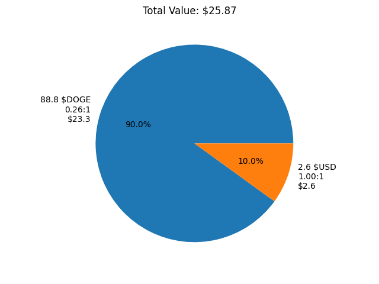
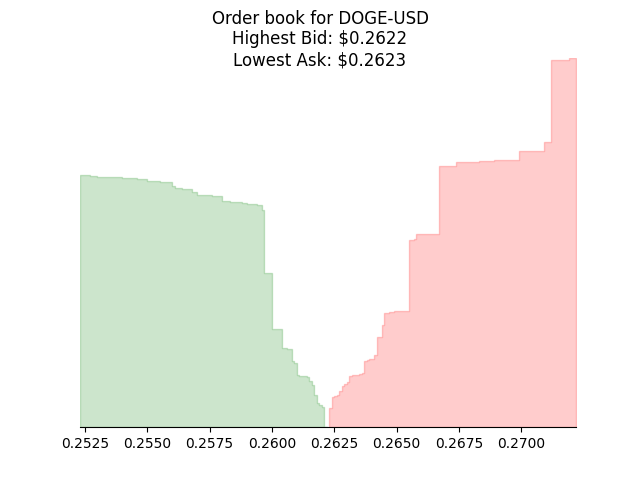

[](https://github.com/ewei2406/CBQuant/actions/workflows/Run_Tests.yml)

# CBQuant

Coinbase Quantitative Trading library

## Setup
Install requirements
```bash
pip install -r requirements.txt
```
Import the library
```python
import CBQ
```

## Usage
### Create an Coinbase Account object using API credentials
```python
from CBQ import account

acc = account.CoinbaseAccount(
    API_KEY=YOUR_API_KEY,
    API_SECRET=YOUR_API_SECRET,
    API_PASSPHRASE=YOUR_API_PASSPHRASE)
```
### Show the distribution of capital for all wallets in a portfolio
```python
from CBQ import visualizations

wallets = acc.get_wallets()

visualizations.show_pie(wallets)
plt.show()
```


### Get the order book for a product pair
```python
from CBQ import visualizations

book = acc.get_book("DOGE-USD")

visualizations.show_book(book, 100, "DOGE-USD")
plt.show()
```


## Testing
Using `pytest`
```python
pytest CBQ
```
Note: Set environmental variables first. All tests use the Sandbox API endpoint.

Example: Using `pytest.ini`
```
[pytest]
env =
    SANDBOX_API_PASSPHRASE = YOUR_SANDBOX_API_PASSPHRASE
    SANDBOX_API_KEY = YOUR_SANDBOX_API_KEY
    SANDBOX_API_SECRET = YOUR_SANDBOX_API_SECRET
```
